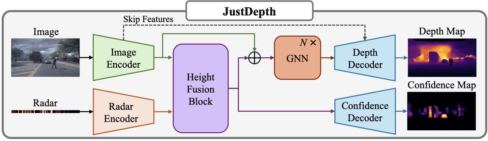
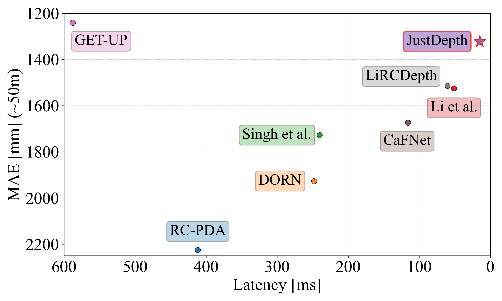
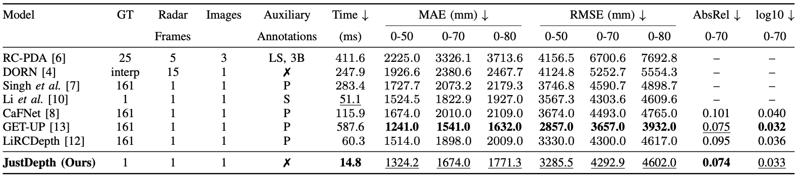

# JustDepth
JustDepth: Real-Time Radar-Camera Depth Estimation with Single-Scan LiDAR Supervision

## Demo Video

## Architecture

  

## Results

  

## Runtime vs Accuracy

  

## Benchmark Table

  

## Dataset
This project uses the **nuScenes** dataset.

### Data Layout
Place the nuScenes dataset under `data/nuscenes/`.  
All required `.pkl` files must be placed directly under the `data/` directory.

Example structure:
~~~text
JustDepth/
  data/
    nuscenes/
    *.pkl
~~~

### Downloads
- **PKL files (data index files):** [Google Drive folder](https://drive.google.com/drive/folders/1WvbM3ydickJU4d3_7ahFWVZ8HLsYjZzo?usp=share_link)
- **Checkpoints (ckpt):** [Google Drive folder](https://drive.google.com/drive/folders/176G2QK_zVTm5zYy4P9ZASQ2K0a4a23ny?usp=share_link)

## Training
Multi-GPU training (torchrun):

~~~bash
CUDA_VISIBLE_DEVICES=<GPU_IDS> torchrun --nproc_per_node=<NUM_GPUS> train.py
# Example:
# CUDA_VISIBLE_DEVICES=0,1 torchrun --nproc_per_node=2 train.py
~~~

Single-GPU training:

~~~bash
CUDA_VISIBLE_DEVICES=<GPU_ID> python train.py
# Example:
# CUDA_VISIBLE_DEVICES=0 python train.py
~~~

## Evaluation
Evaluate with a checkpoint:

~~~bash
python eval.py --checkpoint <PATH_TO_CKPT>
# Example:
# python eval.py --checkpoint /path/to/latest.ckpt
~~~
