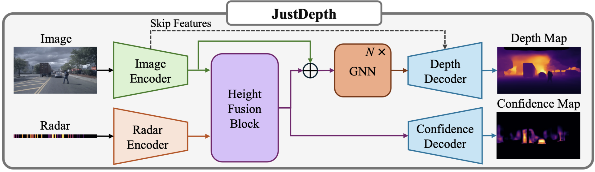

# JustDepth
JustDepth: Real-Time Radar-Camera Depth Estimation with Single-Scan LiDAR Supervision

## Architecture

  

## Results

  

## Training
Multi-GPU training (torchrun):

~~~bash
CUDA_VISIBLE_DEVICES=<GPU_IDS> torchrun --nproc_per_node=<NUM_GPUS> train.py
# Example:
# CUDA_VISIBLE_DEVICES=0,1 torchrun --nproc_per_node=2 train.py
~~~

Single-GPU training:

~~~bash
CUDA_VISIBLE_DEVICES=<GPU_ID> python train.py
# Example:
# CUDA_VISIBLE_DEVICES=0 python train.py
~~~

## Evaluation
Evaluate with a checkpoint:

~~~bash
python eval.py --checkpoint <PATH_TO_CKPT>
# Example:
# python eval.py --checkpoint /path/to/latest.ckpt
~~~