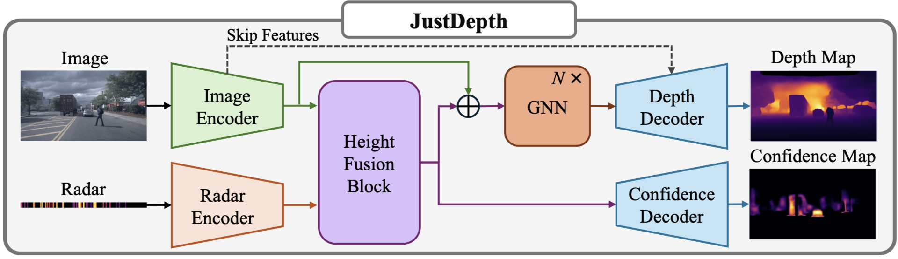
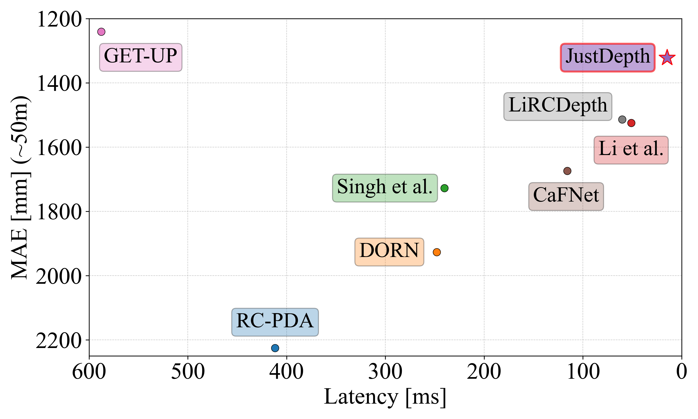
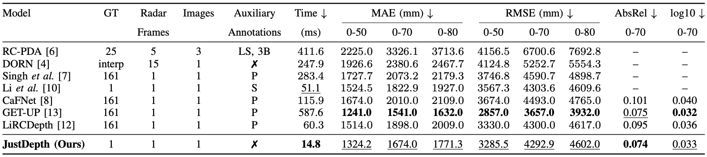

# JustDepth: Real-Time Radar-Camera Depth Estimation With Single-Scan LiDAR Supervision

**JustDepth** is a **real-time radar–camera fusion** model for **depth estimation** trained with **single-scan LiDAR supervision** on **nuScenes**.  
It focuses on a strong **accuracy–latency trade-off** for autonomous driving perception.

- **Task:** radar–camera depth estimation
- **Inputs:** automotive radar returns + RGB image
- **Supervision:** single-scan LiDAR
- **Dataset:** nuScenes
- **Venue:** IEEE Robotics and Automation Letters (RA-L), **Vol. 11, No. 3, March 2026**, pp. **2770–2777**
- **DOI:** 10.1109/LRA.2026.3655274  
- **IEEE Xplore:** https://ieeexplore.ieee.org/abstract/document/11358657

---

## Demo Video

---

## Architecture

  

---

## Results

  

---

## Runtime vs Accuracy

  

---

## Benchmark Table

  

---

## Keywords
radar-camera fusion, depth estimation, graph neural networks, autonomous driving, nuScenes, real-time perception, LiDAR supervision

---

## Dataset (nuScenes)

This project uses the **nuScenes** dataset.

### Data Layout
Place the nuScenes dataset under `data/nuscenes/`.  
All required `.pkl` files must be placed directly under the `data/` directory.

Example structure:
~~~text
JustDepth/
  data/
    nuscenes/samples/
    *.pkl
~~~

### Downloads
- **PKL files (data index files):** https://drive.google.com/drive/folders/1WvbM3ydickJU4d3_7ahFWVZ8HLsYjZzo?usp=share_link
- **Checkpoints (ckpt):** https://drive.google.com/drive/folders/176G2QK_zVTm5zYy4P9ZASQ2K0a4a23ny?usp=share_link

---

## Installation

- **Python:** 3.11.13

### Setup
~~~bash
# (Recommended) create a clean environment
# conda create -n justdepth python=3.11.13 -y
# conda activate justdepth

# install dependencies
pip install -r requirements.txt
~~~

---

## Training

### Multi-GPU training (torchrun)
~~~bash
CUDA_VISIBLE_DEVICES=<GPU_IDS> torchrun --nproc_per_node=<NUM_GPUS> train.py
# Example:
# CUDA_VISIBLE_DEVICES=0,1 torchrun --nproc_per_node=2 train.py
~~~

### Single-GPU training
~~~bash
CUDA_VISIBLE_DEVICES=<GPU_ID> python train.py
# Example:
# CUDA_VISIBLE_DEVICES=0 python train.py
~~~

---

## Evaluation

Evaluate with a checkpoint:
~~~bash
python eval.py --checkpoint <PATH_TO_CKPT>
# Example:
# python eval.py --checkpoint /path/to/latest.ckpt
~~~

---

## Citation

If you find this work useful, please cite:

~~~bibtex
@ARTICLE{11358657,
  author={Yun, Wooyung and Kim, Dongwook and Lee, Soomok},
  journal={IEEE Robotics and Automation Letters},
  title={JustDepth: Real-Time Radar-Camera Depth Estimation With Single-Scan LiDAR Supervision},
  year={2026},
  volume={11},
  number={3},
  pages={2770-2777},
  doi={10.1109/LRA.2026.3655274}
}
~~~
